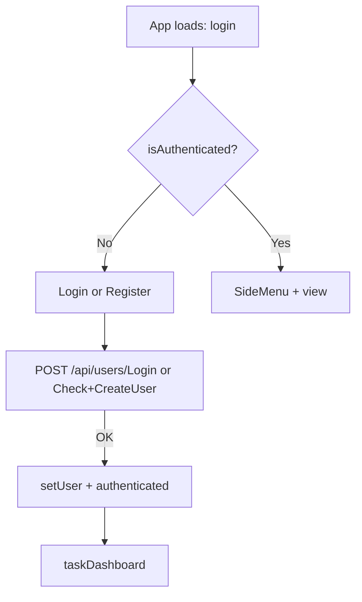
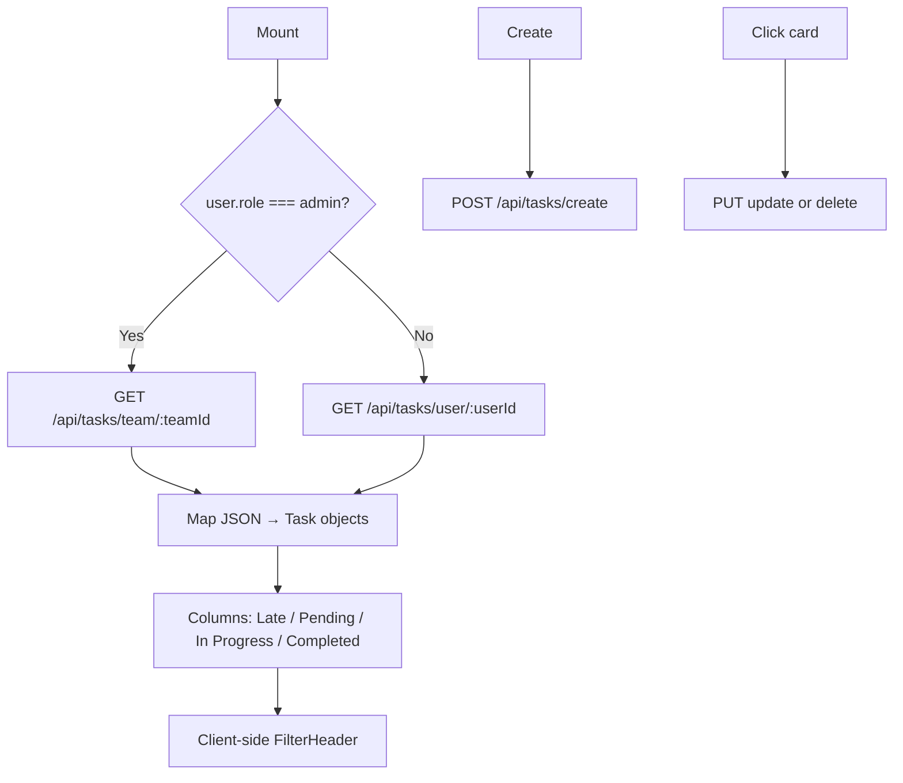
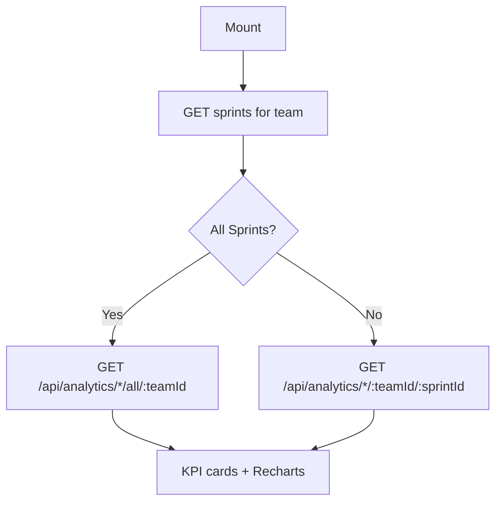

# OctoTask Frontend & UI/UX Reference

> **Purpose:** Single reference for UI/UX work on OctoTask. Synthesized from codebase exploration (March 2026).  
> **Frontend root:** `MtdrSpring/backend/src/main/frontend/`

---

## Table of contents

1. [Executive summary](#1-executive-summary)
2. [Tech stack & tooling](#2-tech-stack--tooling)
3. [How the app runs & is served](#3-how-the-app-runs--is-served)
4. [Directory map](#4-directory-map)
5. [Application architecture](#5-application-architecture)
6. [Navigation & views](#6-navigation--views)
7. [User flows](#7-user-flows)
8. [Component inventory](#8-component-inventory)
9. [Styling & design system](#9-styling--design-system)
10. [API integration (frontend → backend)](#10-api-integration-frontend--backend)
11. [Assets, fonts & icons](#11-assets-fonts--icons)
12. [Testing](#12-testing)
13. [Known issues & UX debt](#13-known-issues--ux-debt)
14. [UI/UX improvement checklist](#14-uiux-improvement-checklist)
15. [Quick commands](#15-quick-commands)

---

## 1. Executive summary

OctoTask’s UI is a **React 18 single-page app** embedded in a **Spring Boot** JAR. There is **one** frontend codebase; no separate Vite app, no `react-router`, and **no URL-based routing**—screens switch via `useState` in `App.js`.

| Aspect | Reality |
|--------|---------|
| **Maturity** | Task Dashboard + Analytics are fully wired; Login/Register work; Home, Team, Profile, Notifications are stubs |
| **Styling** | Dual theme: **auth-dark** + **app-light**; Palette A primary `#7B5CFF` (Octo Evolved); IBM Plex Sans |
| **Feel** | Evolved from Oracle “MyToDo React” sample—legacy CSS, naming, and dead code remain |
| **Docs vs code** | `workspace.json` says “React + Vite + TypeScript”; production uses **CRA + JS/JSX**; Vite is **tests only** |

---

## 2. Tech stack & tooling

| Layer | Technology | Config / path |
|-------|------------|---------------|
| UI | React 18.3 | `package.json` |
| Prod build | Create React App (`react-scripts` 5) | `npm run build` |
| Dev server | CRA on port **3000** | `npm start` |
| Tests | Vitest + Testing Library + MSW | `vite.config.mjs` |
| Styling | Co-located `.css` (no Tailwind/Bootstrap) | 14 CSS files |
| UI libs (installed) | MUI 5, Emotion | **Barely used** (legacy `NewItem.js` only) |
| UI libs (used) | `react-icons`, Recharts | Side nav, analytics |
| Dates | `moment`, `react-moment` | Various |
| HTTP | Native `fetch` | `src/services/*.js` |
| API base | `'/api'` | `src/API.js` |
| Package manager | npm | `package-lock.json` |
| Backend build | Maven + `frontend-maven-plugin` | `backend/pom.xml` |
| Language | **JSX/JS** in app; **TSX only in tests** | `tsconfig.json` (`noEmit`) |

**Not in repo:** Gradle, root `package.json`, react-router, Thymeleaf/JSP, separate frontend deploy.

---

## 3. How the app runs & is served

### Production / CI

```text
npm run build  →  frontend/build/
       ↓
Maven copies build/ → target/classes/static/
       ↓
Spring Boot JAR :8080  →  static assets at /  +  REST at /api/*
```

- Single container; Kubernetes uses port **8080** (`todolistapp-springboot.yaml`).
- **No SPA fallback controller**—fine today because URLs never change per view.
- `homepage: "."` in `package.json` keeps asset paths relative inside the JAR.

### Local development

| Mode | Command | UI | API |
|------|---------|-----|-----|
| Frontend only | `cd .../frontend && npm start` | `:3000` | Proxied `/api` via `setupProxy.js` |
| Integrated | `npm run build` then `mvnw spring-boot:run` | `:8080` | Same host `/api` |

**Proxy mismatch:** `setupProxy.js` targets **`localhost:9000`**, but Spring and tests use **8080**. For CRA dev, proxy should likely point at **8080** unless something else listens on 9000.

**CORS:** `CorsConfig.java` allows `*` on `/**`—relevant when UI (:3000) and API (:8080) differ.

---

## 4. Directory map

```text
MtdrSpring/backend/src/main/frontend/
├── package.json
├── vite.config.mjs          # Vitest only
├── tsconfig.json
├── public/
│   ├── index.html           # SPA shell (#root)
│   ├── manifest.json        # Legacy "MyToDo React" name
│   └── swagger_APIs_definition.*
└── src/
    ├── index.js             # ReactDOM.render → <App />
    ├── index.css            # Legacy Oracle Redwood global styles
    ├── App.js               # Auth gate + view router
    ├── API.js               # export default '/api'
    ├── setupProxy.js        # Dev proxy
    ├── NewItem.js           # UNUSED legacy todo demo (MUI)
    ├── assets/
    │   └── logoSymbol.svg   # Only tracked image
    ├── components/
    │   ├── background/
    │   ├── filterHeader/
    │   ├── headerStart/
    │   ├── sideMenu/
    │   ├── task/            # taskCard.jsx, Task.js (model)
    │   ├── taskForm/
    │   └── taskUpdate/
    ├── controller/          # Orchestration (not React “controllers”)
    ├── services/            # fetch() wrappers
    └── views/
        ├── login/
        ├── register/
        ├── taskDashboard/
        ├── analytics/
        └── notifications/   # stub
```

---

## 5. Application architecture

### Layered data flow

```text
Views (JSX)
    ↓
Controllers (src/controller/*.js)  — mapping, KPI math, orchestration
    ↓
Services (src/services/*.js)       — fetch()
    ↓
API.js → '/api'
    ↓
Spring @RestController
```

### Controller files

| File | Role |
|------|------|
| `logInController.js` | Login wrapper |
| `registerController.js` | Register + duplicate check |
| `tasksViewController.js` | CRUD + `Task` model mapping |
| `filterController.js` | Sprints + team members |
| `analyticsController.js` | Analytics + KPI grading |
| `operationsController.js` | UI helpers only (`getTimeUntilDue`) |

### Entry & root component

- **Bootstrap:** `index.js` uses legacy `ReactDOM.render` (not `createRoot`).
- **Root:** `App.js` holds `isAuthenticated`, `currView`, `user`.

```32:47:MtdrSpring/backend/src/main/frontend/src/App.js
function App() {
  const [isAuthenticated, setAuthenticated] = useState(false);
  const [currView, setCurrView] = useState("login");
  const [user, setUser] = useState(null);
  // ...
  function handleNavigate(view) {
    setCurrView(view);
  }
```

---

## 6. Navigation & views

### No URL routing

- No `react-router`, no hash routes, no `window.location` navigation.
- **Browser refresh → back to login** (state lost).
- **No logout** — `isAuthenticated` is never set back to `false`.
- **No persisted session** — no localStorage/cookies/JWT on the client.

### View IDs (`currView`)

| `currView` | Screen | File | Status |
|------------|--------|------|--------|
| `login` | Login | `views/login/LoginView.jsx` | Complete |
| `register` | Register | `views/register/RegisterView.jsx` | Complete (bugs) |
| `taskDashboard` | Kanban board | `views/taskDashboard/taskDashboard.jsx` | **Primary feature** |
| `analytics` | Charts + KPIs | `views/analytics/AnalyticsView.jsx` | Complete |
| `notifications` | Notifications | `views/notifications/notifications.jsx` | Stub (`<h1>`) |
| `home` | Home | inline in `App.js` | Stub |
| `team` | Team | inline in `App.js` | Stub |
| `profile` | Profile | inline in `App.js` | Stub |

Default after login/register: **`taskDashboard`**.

### Unauthenticated shell

```text
HeaderStart (Log In | Create Account)
    → currView: login | register
LoginView ↔ RegisterView (span onClick links)
    → success → handleUserAfter → authenticated + taskDashboard
```

### Authenticated shell

```text
SideMenu (fixed ~18% width)
    → onNavigate(home | taskDashboard | analytics | notifications | team | profile)
    → children = selected view
Background wraps content (gradient + pattern)
```

### Overlays (not separate views)

| UI | File | Trigger |
|----|------|---------|
| Create task modal | `components/taskForm/taskForm.jsx` | “+ Create Task” |
| Edit task modal | `components/taskUpdate/taskUpdate.jsx` | Click task card |
| Filter panel | `components/filterHeader/filterHeader.jsx` | Filter toggle (client-side filter) |

---

## 7. User flows

### 7.1 Authentication



- Login errors: `alert()`.
- Register: duplicate check then create; error state **broken** (see §13).

### 7.2 Task dashboard (Kanban)



- **Admin:** all team tasks.
- **Non-admin:** assigned tasks only.
- Filter metadata from API; **title/status/priority/date filtering is client-side** in `taskDashboard.jsx`.

### 7.3 Analytics



- KPI grades computed in `analyticsController.js`.
- **Recent Activity** panel is always empty (`recentActivity` never set).

### 7.4 Stub screens

Home, Notifications, Team, Profile — static headings, no API calls.

---

## 8. Component inventory

### Layout / chrome

| Component | Path | Role |
|-----------|------|------|
| `Background` | `components/background/` | Full-viewport gradient + animated pattern |
| `HeaderStart` | `components/headerStart/` | Pre-auth top bar |
| `SideMenu` | `components/sideMenu/` | Post-auth sidebar + `children` slot |

### Feature components

| Component | Path | Used by |
|-----------|------|---------|
| `TaskCard` | `components/task/` | Dashboard columns |
| `TaskForm` | `components/taskForm/` | Create modal (portal) |
| `TaskUpdate` | `components/taskUpdate/` | Edit modal (inline) |
| `FilterHeader` | `components/filterHeader/` | Dashboard filters |
| `Task` (model) | `components/task/Task.js` | State/priority labels |

### Reusability gaps (UI/UX relevant)

- No shared `Button`, `Input`, `Modal`, or `Card` primitives.
- Login/register duplicate markup; register **missing** shared brand CSS.
- Two modal implementations (different z-index, portal vs inline, visual language).
- `getPriorityClass()` duplicated in `taskCard.jsx` and `taskUpdate.jsx`.

---

## 9. Styling & design system

### Approach (enterprise refresh 2026-06-01)

- **Tokens:** `src/theme/tokens.css` — scoped by `data-theme="auth-dark"` | `data-theme="app-light"`
- **Shell:** `src/theme/shell.css` — header 48px, rail, empty states, page chrome
- **Global:** `src/theme/global.css` — IBM Plex Sans, focus-visible, scrollbar
- **Auth:** `src/theme/auth.css` — split brand + form panels
- **Modals:** `src/theme/modal.css` — unified `.modal-*` and `.tu-modal-*`
- **Charts:** `src/theme/charts.js` — light grid/tooltip for Recharts
- **Co-located CSS** per view/component; values use `var(--*)`

Docs: [ENTERPRISE_UI_REDESIGN_PLAN.md](./ENTERPRISE_UI_REDESIGN_PLAN.md), [ENTERPRISE_POST_AUDIT.md](./ENTERPRISE_POST_AUDIT.md), [ISO_POST_AUDIT.md](./ISO_POST_AUDIT.md) (Phase 1)

### Themes

| `data-theme` | Where | Background / surfaces |
|--------------|-------|------------------------|
| `auth-dark` | Login, register (`app-shell--unauth`) | `#12141a` / `#22262f` |
| `app-light` | Authenticated shell, modals (portal wrapper) | `#f4f5f7` / `#ffffff` |

Set on `Background.jsx` (`shell-stage`) and modal portals in `taskForm.jsx` / `taskUpdate.jsx`.

### Brand palette (app-light primary)

| Token | Value | Use |
|-------|-------|-----|
| `--color-primary` | `#7b5cff` | Solid CTAs (Palette A — Octo Evolved) |
| `--color-border` | `#e1e3e8` | Cards, columns, inputs |
| `--color-surface` | `#ffffff` | Kanban columns, KPI, charts |
| `--color-status-*` | tokens.css | Column accent bars |

### Fonts

| Font | Loaded | Used in |
|------|--------|---------|
| **IBM Plex Sans** | `theme/global.css` | App-wide |

### Icons & charts

- **react-icons** (`fa`, `md`) — navigation, cards, analytics headers.
- **Recharts** — `AnalyticsView.jsx` (bar + radial charts).
- **@mui/icons-material** — installed, **unused**.

### Responsive design

- **`@media (max-width: 900px)`** in `taskDashboard.css`, `filterHeader.css`, **`sideMenu.css`** (icon-only sidebar at 72px).
- Sidebar fixed **18%** on desktop — no hamburger state (ISO-safe).
- Analytics uses **viewport % heights** — no breakpoints.
- Desktop-first; Kanban uses horizontal scroll on narrow screens.

### Accessibility snapshot

| Good | Gaps |
|------|------|
| FilterHeader `htmlFor`/`id` pairs | Modals: no `role="dialog"`, focus trap, Escape |
| `lang="en"` in `index.html` | Modals: no focus trap |
| Some `alt` on logos | Task cards: `div onClick`, not keyboard-focusable |
| Tests use `getByRole` | Side menu: `<button>` wrapping `<h3>` |
| | No loading/error UI; `alert()` / `confirm()` |

---

## 10. API integration (frontend → backend)

Base: **`/api`** (`src/API.js`). All calls use **`fetch`**.

### Users

| Frontend | Method | Endpoint | Service |
|----------|--------|----------|---------|
| Login | POST | `/api/users/Login` | `LoginService.js` |
| Check duplicates | POST | `/api/users/Check` | `RegisterService.js` |
| Create user | POST | `/api/users/CreateUser` | `RegisterService.js` |

Backend: `UserController.java`

### Tasks

| Frontend | Method | Endpoint | Service |
|----------|--------|----------|---------|
| Team tasks | GET | `/api/tasks/team/{teamId}` | `TasksService.js` |
| User tasks | GET | `/api/tasks/user/{userId}` | `TasksService.js` |
| Create | POST | `/api/tasks/create` | `TasksService.js` |
| Update | PUT | `/api/tasks/update/{id}` | `TasksService.js` |
| Delete (logical) | PUT | `/api/tasks/delete/{id}` | `TasksService.js` |

Backend: `TaskController.java`

### Filters

| Frontend | Method | Endpoint |
|----------|--------|----------|
| Sprints | GET | `/api/filter/sprints/{teamId}` |
| Team members | GET | `/api/filter/team-members/{teamId}` |

Backend: `FilterController.java`

### Analytics (representative)

| Frontend | Endpoint pattern |
|----------|------------------|
| Task counts | `/api/analytics/numtasks/{teamId}/{sprintId}` or `.../all/{teamId}` |
| Completed / pending / late | `/api/analytics/completedtasks/...`, `pendingtasks/...`, `latetasks/...` |
| Member status | `/api/analytics/memberstatus/{teamId}/{sprintId}` |
| Work hours | `/api/analytics/workhours/...` |
| Averages | `/api/analytics/avgtasks/{teamId}`, `avghours/{teamId}` |
| By member per sprint | `/api/analytics/completedtasks/bymember/sprints/{teamId}`, etc. |

Backend: `StadisticsController.java`

### Not called from UI

- `GET /api/database/ping` (`DatabaseController`)

---

## 11. Assets, fonts & icons

| Asset | Referenced | In repo? |
|-------|------------|----------|
| `src/assets/logoSymbol.svg` | Sidebar, header, login, register | **Yes** |
| `public/logo.svg` | Favicon | **Yes** (copy of logoSymbol) |
| `backgroundPattern.webp` | Replaced by CSS gradients in `Background.css` | N/A |

---

## 12. Testing

| File | Scope |
|------|-------|
| `views/login/LoginView.test.tsx` | Login + navigate to register |
| `views/taskDashboard/TaskDashboard.test.tsx` | Dashboard, modals, filters |
| `views/analytics/AnalyticsView.test.tsx` | Analytics render |
| `tests/smoke/Smoke.test.tsx` | HTTP smoke (`localhost:8080`) |

Run: `npm test` or `npm run test:watch` (Vitest, not CRA Jest).

Tests mock `http://localhost:8080/api/...` — aligns with Spring, not `setupProxy` port 9000.

---

## 13. Known issues & UX debt

### Critical / functional

1. ~~**Missing images**~~ — Fixed: `logoSymbol.svg` + CSS background (2026-06-01).
2. ~~**Register unstyled brand**~~ — Fixed: `theme/auth.css` shared (2026-06-01).
3. **Register errors broken** — `const [setError] = useState('')` misnames setter; `.errorText` never shown.
4. ~~**`class` vs `className`**~~ — Fixed on auth views (2026-06-01).

### Architecture / dev experience

5. **No logout, no session persistence** — refresh loses auth.
6. **No URL routing** — can’t bookmark or share a screen.
7. ~~**CRA proxy → :9000**~~ — Fixed to `:8080` (2026-06-01); use `local` Spring profile for dev.
8. **Docs say Vite+TS**; app is CRA+JS.

### Styling / consistency

9. **Two modal systems** (z-index 9999 vs 1000, portal vs inline).
10. **Dead CSS** — `index.css` tables/buttons; unused rules in `taskDashboard.css`.
11. **Dead code** — `NewItem.js`, outdated `App.js` header comment.
12. **Invalid CSS** — `background-color: linear-gradient(...)` on button hover; `font-size: 0.9 em` typo.
13. **MUI installed but unused** (except legacy `NewItem.js`).
14. **Mixed EN/ES** — “Sin fecha”, Spanish delete confirm.
15. **No loading/error states** — failures only `console.error`.
16. **Analytics Recent Activity** — always empty.
17. **Terminology** — “Difficulty” vs “Priority” in different places.

---

## 14. UI/UX improvement checklist

Use this as a working backlog for UI/UX-only work (no backend required unless noted).

### Foundation

- [x] Add missing assets or replace with `logoSymbol.svg` everywhere (2026-06-01)
- [x] Fix `class` → `className` on auth views (2026-06-01)
- [x] Share auth layout — `theme/auth.css` (2026-06-01)
- [x] Single global font — IBM Plex Sans via `theme/global.css` (2026-06-01)
- [x] Extract design tokens — `theme/tokens.css` Palette A Octo Evolved `#7B5CFF` (2026-06-01)
- [x] Quarantine dead CSS — `index.css` trimmed (2026-06-01)
- [x] Tokenize all 14+ CSS files — `var(--*)` throughout (2026-06-01)
- [x] Analytics chart colors — `theme/charts.js` (2026-06-01)
- [x] ISO pre/post audits — `doc/ISO_PRE_AUDIT.md`, `doc/ISO_POST_AUDIT.md` (2026-06-01)

### Navigation & shell

- [ ] Add `react-router` (or similar) + SPA fallback in Spring (optional backend)
- [ ] Logout control in `SideMenu`
- [ ] Persist session (`localStorage` / cookie — needs backend auth design)
- [ ] Mobile sidebar (drawer/hamburger)
- [ ] Active nav state (`aria-current`)

### Components

- [ ] Unified `Modal` primitive (focus trap, Escape, `aria-modal`)
- [ ] Shared `Button`, `Input`, `Select`, `PriorityBadge`
- [ ] Merge `TaskForm` + `TaskUpdate` styling/behavior where possible
- [ ] Replace `div onClick` task cards with accessible buttons/cards
- [ ] Inline error UI instead of `alert()` / `confirm()`

### Views to build out

- [ ] Home — landing / summary
- [ ] Notifications — real list or empty state
- [ ] Team — member list (may need API)
- [ ] Profile — user settings (may need API)

### Polish

- [ ] Loading skeletons / spinners on dashboard & analytics
- [ ] Empty states for Kanban columns and charts
- [ ] Fix register error handling + brand styles
- [ ] Wire or remove Analytics “Recent Activity”
- [ ] Align copy (EN only or i18n strategy)
- [x] Update `manifest.json` and `public/index.html` metadata to “OctoTask” (2026-06-01)

### Dev ergonomics

- [ ] Fix `setupProxy.js` to port **8080**
- [ ] Consider migrating CRA → Vite for dev (optional; large scope)

---

## 15. Quick commands

```bash
# Frontend root
cd MtdrSpring/backend/src/main/frontend

# Dev UI only (port 3000, proxied /api)
npm install
npm start

# Tests
npm test

# Production build (output: build/)
npm run build

# Full stack locally (after npm run build)
cd ../..   # MtdrSpring/backend
./mvnw spring-boot:run
# → http://localhost:8080
```

See also: `MtdrSpring/backend/README-local.md`, architecture ADRs in `doc/arch/`.

---

## Appendix: File index (all UI source)

| Path |
|------|
| `src/App.js` |
| `src/index.js`, `src/index.css`, `src/API.js`, `src/setupProxy.js` |
| `src/views/login/LoginView.jsx`, `.css` |
| `src/views/register/RegisterView.jsx`, `.css` |
| `src/views/taskDashboard/taskDashboard.jsx`, `.css` |
| `src/views/analytics/AnalyticsView.jsx`, `.css` |
| `src/views/notifications/notifications.jsx`, `.css` |
| `src/components/background/`, `headerStart/`, `sideMenu/` |
| `src/components/task/`, `taskForm/`, `taskUpdate/`, `filterHeader/` |
| `src/controller/*.js` |
| `src/services/*.js` |
| `public/index.html`, `public/manifest.json` |

---

*Generated for UI/UX workstreams. Update this doc when routing, design tokens, or view completeness change materially.*
